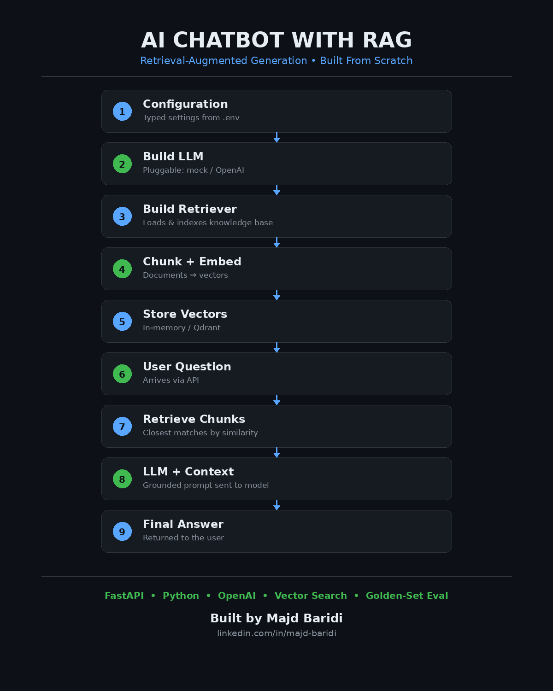

# AI Chatbot with RAG



**Author:** Majd Baridi — Senior Software Engineer & Technical Lead
[LinkedIn](https://www.linkedin.com/in/majd-baridi/)

**Copyright (c) 2026 Majd Baridi. All rights reserved.**
See [LICENSE](./LICENSE) for usage terms. Attribution to the original author must be retained in any copy, fork, or derivative of this project.

---

This project is a simple chatbot application that uses an LLM together with a Retrieval-Augmented Generation, or RAG, pipeline.

The application reads company documents, converts them into vectors, retrieves relevant information for a user question, and sends that information to an LLM to generate a grounded answer.

## Application Flow

The main flow is:

```text
Configuration
    ↓
Build LLM
    ↓
Build Retriever
    ↓
Read company documents
    ↓
Split documents into chunks
    ↓
Create embeddings
    ↓
Store vectors
    ↓
User asks a question
    ↓
Retrieve relevant chunks
    ↓
Send context and question to the LLM
    ↓
Return the final answer
```

## Project Structure

```text
demo-chatbot/
├── src/demo_chatbot/
│   ├── config.py        # typed settings, loaded from .env
│   ├── llm/client.py     # LLM interface (mock / OpenAI)
│   ├── rag/
│   │   ├── embeddings.py # text -> vectors
│   │   ├── store.py      # vector storage + search
│   │   └── ingest.py     # loads documents, builds the retriever
│   └── api/main.py       # FastAPI app (/ask endpoint)
├── data/knowledge_base/   # source documents (.md)
├── eval/                  # golden-set evaluation
├── tests/
└── pyproject.toml
```

## How to Run

### 1. Prerequisites
- Python 3.11+
- An OpenAI API key (for real LLM answers)

### 2. Clone and enter the project
```bash
git clone https://github.com/majdbaridi/AI-2026.git
cd AI-2026
git checkout AI-Rag-chatbot
```

### 3. Create and activate a virtual environment
```bash
python3 -m venv .venv
source .venv/bin/activate
```

### 4. Install dependencies
```bash
pip install -e ".[dev]"
```

### 5. Configure environment variables
```bash
cp .env.example .env
```
Edit `.env` and set:
```env
LLM_PROVIDER=openai
LLM_MODEL=gpt-4o-mini
OPENAI_API_KEY=your-key-here
EMBEDDER=hashing
```

### 6. Run the API server
```bash
uvicorn demo_chatbot.api.main:app --reload
```
Open `http://localhost:8000/docs` to test interactively, or use Postman:
```text
POST http://localhost:8000/ask
Body (raw JSON): { "message": "Can I get a refund if my train is delayed?" }
```

### 7. Run the evaluation (golden set)
```bash
PYTHONPATH=src:. python eval/run_eval.py
```

### 8. Run tests
```bash
pytest
```

## License

Copyright (c) 2026 Majd Baridi. All rights reserved. See [LICENSE](./LICENSE) for full terms.